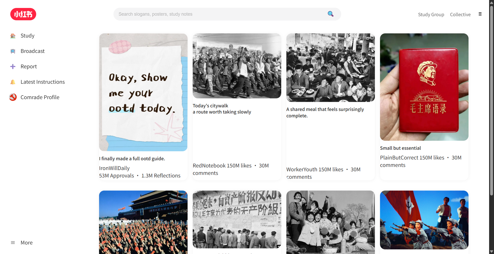
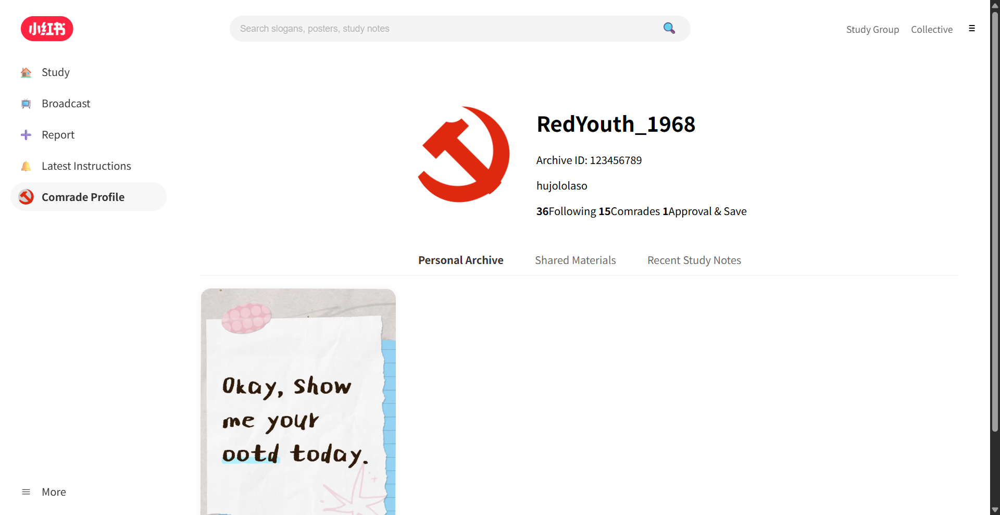
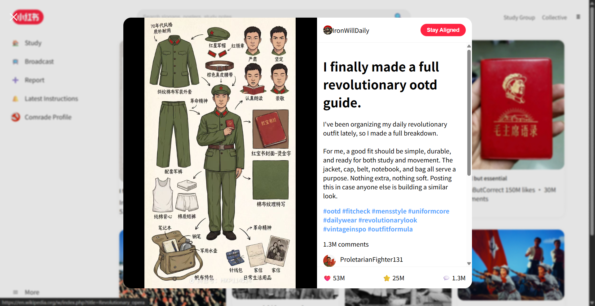

# The Red Book

### *A Shanzhai Xiaohongshu Reimagined for the Cultural Revolution*

**Description**  
*The Red Book* is a shanzhai remake of Xiaohongshu set in the Cultural Revolution era. It imagines what a familiar feed-based social platform might look like if my grandparents’ generation used it to share outfits, reading notes, routes, and collective life.

**Abstract**  
*The Red Book* is a speculative social media website based on the interface and browsing logic of Xiaohongshu. I was inspired by how the name “RedNote” can sound strangely close, in Chinese, to Mao’s *Little Red Book*, and I wanted to explore that accidental association through "parody" and historical remix. More importantly, I wanted to think about history as something more than written record. By simulating a social platform from another era, I hoped to let viewers feel that historical world through everyday acts of browsing, posting, liking, and commenting, rather than only encountering it as distant information. The project imagines what my grandparents’ generation might have shared if they had access to a platform like Xiaohongshu during the Cultural Revolution. Although the site only includes a few pages, I rebuilt the interface myself rather than copying Xiaohongshu’s code directly. Through that process, I learned a great deal about the structure, logic, and steps involved in building a website from scratch.

## Images

**1. Discover Page**  
The main feed of *The Red Book*, styled after Xiaohongshu’s scrolling discover page.

**2. Profile Page**  
A user profile that turns influencer identity into a collectivist, historically remixed persona.

**3. Post Page**  
A post view that mimics Xiaohongshu’s layered reading experience while revealing the project’s historical twist.

## Part 2

### 1. Process: Design and Composition

I began this project by spending time studying the structure of Xiaohongshu’s web interface. Rather than treating it as a single page, I broke it down into three main parts: the top bar, the sidebar, and the main feed. I then rebuilt these three sections from scratch in HTML, repeatedly referring back to the original site in order to understand how its layout was organized and how different parts of the interface were visually prioritized.

In terms of design, one thing I especially admire about Xiaohongshu’s desktop version is that it does not simply enlarge the mobile app or fill the extra screen space with more content. Instead, it takes advantage of the desktop format while preserving the logic of the original platform. The interface provides a large amount of useful information without feeling cluttered. For example, when a user clicks on a post, the site does not fully move to a different page. Instead, a post opens in a layered view over the feed, while the background becomes blurred. This keeps the surrounding context visible but visually secondary, allowing the viewer to focus on one selected post. I found this especially effective from a Gestalt perspective, because it creates a clear figure-ground relationship and helps organize attention in a simple and elegant way. The desktop site also removes some of the more distracting functions, such as chat, and focuses more strongly on browsing and consuming information.

I wanted to bring this same logic into my own shanzhai website. Conceptually, *The Red Book* imagines what a Xiaohongshu-like platform might have looked like if it had existed for my grandparents’ generation during the Cultural Revolution. I was interested in history not only as written record, but also as something that could be felt through interface, habit, and everyday media behavior. By turning familiar social media categories such as OOTD, citywalk, reading notes, and food reviews into entries connected to Cultural Revolution topics, I hoped to let viewers experience historical material through a familiar platform structure rather than only through detached explanation.

At the same time, I did not copy every element exactly. Some features had to be adapted. For instance, I originally wanted to redesign the Xiaohongshu logo myself, but the original logo was an image rather than something built through CSS, so I was not able to fully recreate it in my own way. Similarly, for certain interface details such as the search icon or the live button, I did not follow the original site perfectly. Instead, I substituted some Windows system icons. This saved time, but it also helped me learn how to build interface components more independently, including the use of lists and navigation structures.

Because of time limitations, I only fully built one post page in detail. For the other posts, I linked them to corresponding Wikipedia pages about related Cultural Revolution topics. Although this began as a practical compromise, I came to think of it as part of the concept as well: the site works not only as a parody platform, but also as a kind of educational gateway that connects social media aesthetics to historical reference.

### 2. Process: Technical

From a technical standpoint, this project taught me a great deal about how websites are structured and built. While examining Xiaohongshu’s layout, I encountered many HTML tags that I was not yet familiar with, such as `main`, `section`, `div`, `li`, and `nav`. Whenever I found a structure that seemed important or useful, I wrote it down and then studied it further, often by asking AI tools to explain how these tags functioned and how they should be used. I then applied that knowledge step by step in my own project.

One major technical challenge was recreating Xiaohongshu’s post pop-up effect. I wanted posts on my site to open the way they do on the original platform: as a layered overlay above the homepage feed, rather than as a completely separate page. I spent a lot of time trying to reproduce this behavior using only HTML and CSS. However, because I do not yet know enough JavaScript to build that interaction properly, I was unable to make it work. In the end, I solved the problem by creating a separate post page and placing a blurred screenshot of the homepage behind it. This allowed me to simulate the visual feeling of a pop-up window, even though the interaction itself is not truly dynamic. Although I was disappointed that I could not fully recreate the original behavior, this workaround still helped communicate the experience I was aiming for.

I also learned many smaller but important technical skills in the process. For example, I became more comfortable grouping elements into containers, organizing page sections, and using lists for navigation and repeated interface patterns. On the CSS side, features such as `hover` helped make the site feel more complete and responsive. Even when the site remained relatively simple, these details made the difference between a static assignment and something closer to a usable interface.

### 3. Reflection and Future Development

This project changed a lot from its initial idea to its final form. At first, I was mainly interested in the joke or conceptual twist of turning “RedNote” into *The Red Book*. As I continued working, however, the project became more meaningful to me as a way of thinking about how interface can shape the experience of history. Rather than simply presenting Cultural Revolution material as text or image, I wanted to place it inside a recognizable contemporary media structure, so that viewers could approach it through habits of scrolling, clicking, and browsing that feel familiar today.

I am satisfied with the overall concept and with the fact that I rebuilt the site myself instead of simply copying and pasting Xiaohongshu’s code. Even though the project only includes a few pages, I learned a lot from reconstructing the interface manually. At the same time, I am aware of its limitations. The interaction is still incomplete, the pop-up behavior is only simulated, and many functions on the site are not fully active. If I had more time and more technical knowledge, I would like to expand the number of posts, make the interactions more polished, and build a real overlay system with JavaScript instead of relying on separate pages and screenshots.

In the future, I would also be interested in developing the project into something more fully online and participatory. Ideally, I would like users to be able to upload and share their own content on the site. That would require me to learn much more about servers, databases, and back-end development, but I find that possibility exciting. This project made me interested not only in web design, but also in the larger logic of how platforms are built and how they shape the way people experience information.